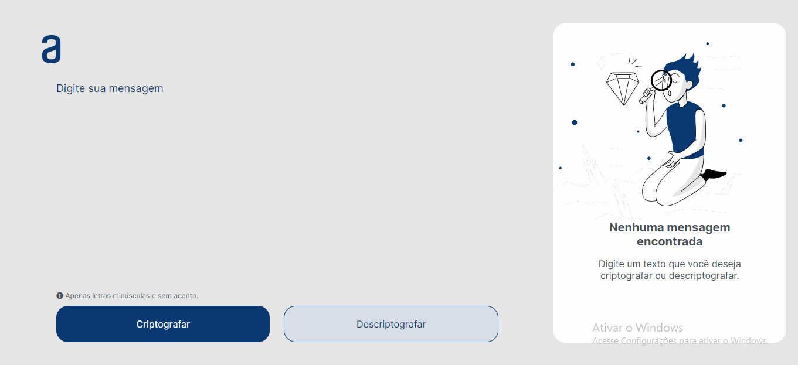

# ✅ Alura Cripto - Criptografia de mensagens ✅

Alura Cripto é um sistema de criptografar e descriptografar mensagens de textos com Javascript. A regra para criptografar as mensagens, segue o modelo de substituir as vogais por determinadas palavras, e para descriptografar é apenas substituir a palavra pela vogal correspondente.

### Regras para criptografar, as "chaves" utilizadas são:

* A letra "e" é convertida para "enter";
* A letra "i" é convertida para "imes";
* A letra "a" é convertida para "ai";
* A letra "o" é convertida para "ober";
* A letra "u" é convertida para "ufat".

# ✨ Overview do projeto✨

__O Challenge__ 🚀

Os usuarios serão capazes de:

* Criptografar as mensagens
* Descriptografar as mensagens

__Screenshot__ 📱

[Quero Ver!](https://aluracriptografia.vercel.app/)

# 🔨 Tech usadas 🔨

* HTML
* CSS
* JavaScript
* Hospedagem Vercel

# 👷 Autor 👷

Leandro Jesus Do Nascimento
